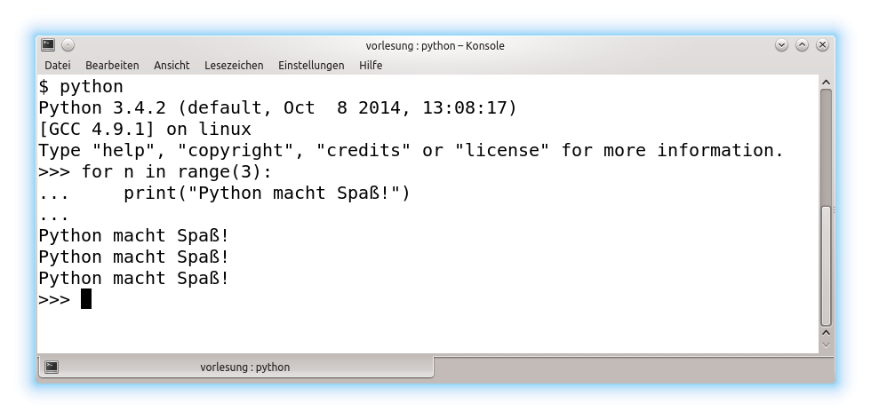
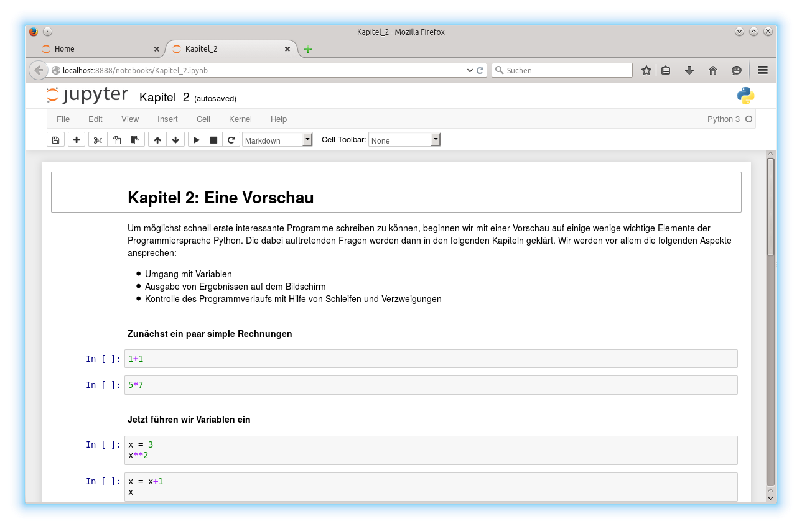
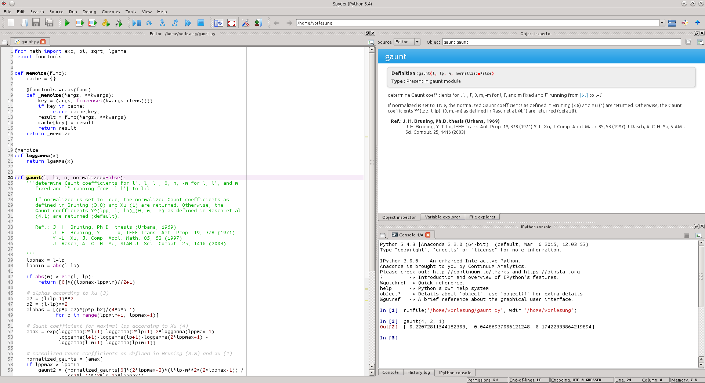

**********
Einführung
**********

===========================
Warum Programmieren lernen?
===========================

Computer sind heutzutage allgegenwärtig, sei es im Auto oder in Form eines
Smartphones, um nur zwei Beispiele zu nennen. Um Autofahren zu können, muss man
dennoch keine Programmiersprache beherrschen. Man muss auch nicht unbedingt
Apps für sein Smartphone programmieren, auch wenn dies eine wesentlich
produktivere Tätigkeit sein kann als die Benutzung einer App, wie der
amerikanische Präsident kürzlich in einer Ansprache betonte:

  Don’t just buy a new videogame; make one. Don’t just download the latest app;
  help design it. Don’t just play on your phone; program it.
  (B. H. Obama II, 8.12.2013 [#obama]_)

Vielleicht ist es aber auch schon interessant, eine gewisse Vorstellung davon zu
bekommen, was in der Steuerelektronik eines Autos oder in einem Smartphone vor
sich geht.

Als Studentin oder Student der Naturwissenschaften wird man kaum das Studium
absolvieren können, ohne einen Computer zu benutzen. Schließlich muss eine
Abschlussarbeit erstellt werden, die vielleicht auch die eine oder andere
Abbildung enthalten sollte. Natürlich wird man für diesen Zweck kaum ein eigenes
Textverarbeitungsprogramm erstellen, aber bereits bei der Erstellung von 
Abbildungen nach den eigenen Vorstellungen können Programmierkenntnisse nützlich
werden.

Bevor eine Abschlussarbeit geschrieben werden kann, sind Daten zu sammeln und
zu analysieren. Dabei muss vielleicht die Kommunikation zwischen Messgerät und
Computer programmiert werden. Oder man kann sich bei der Auswertung der Daten
mit Hilfe eines selbst geschriebenen Programms viel Zeit und Mühe sparen. Bei
einer theoretisch ausgerichteten Arbeit wird man vielleicht feststellen, dass
das, was sich mit Papier und Bleistift rechnen lässt, schon lange von anderen
gemacht wurde. Viele interessante Probleme erfordern daher den Einsatz des
Computers, und dabei wird man ohne Programmierkenntnisse nicht weit kommen.
Nicht ohne Grund stellt man heute neben die Experimentalphysik und die
Theoretische Physik häufig die Numerische Physik oder *Computational Physics*.
Genauso wie Physiker und Materialwissenschaftler mit Papier und Bleistift
umgehen können müssen, müssen sie auch in der Lage sein, ein Programm zu
schreiben, um die alltäglichen Aufgaben bei der Forschungsarbeit lösen zu
können. Ebenso selbstverständlich wird diese Fähigkeit auch für viele
Tätigkeiten in der Industrie vorausgesetzt.

Programmieren zu können ist aber nicht nur eine Notwendigkeit für
Naturwissenschaftler, Programmieren kann auch Spaß machen. So wie das Knobeln
an einer wissenschaftlichen Aufgabe (hoffentlich) Spaß macht, gilt dies
auch für die Suche nach einer eleganten und effizienten Lösung eines Problems
auf dem Computer [#euler]_. Zugegeben: Es kann durchaus nerven, wenn der
Computer ständig Fehler anmahnt und dabei äußerst starrsinnig ist. Allerdings
hat er praktisch immer recht. Da hilft es nur, die Fehlermeldungen ernst zu
nehmen und ein bisschen Gelassenheit an den Tag zu legen. Dafür beschwert sich
der Computer auch nicht, wenn er uns lästige Arbeit abnimmt, indem er zum
Beispiel zuverlässig immer wieder die gleichen Programmanweisungen abarbeitet.

=============
Warum Python?
=============

Das Ziel dieser Vorlesung ist es in erster Linie, eine Einführung in das
Programmieren für Studierende ohne oder mit nur wenig Programmiererfahrung
anzubieten. Aus der Vielzahl von existierenden Programmiersprachen wird hierfür
die Programmiersprache *Python* verwendet, wobei allerdings vermieden wird,
spezifische Eigenschaften der Programmiersprache zu sehr in den Vordergrund zu
rücken. Gründe für die Wahl von Python sind unter anderem [#whypython]_:

* Es handelt sich um eine relativ leicht zu erlernende Programmiersprache, die
  aber dennoch sehr mächtig ist.
* Python ist für die gängigen Betriebssysteme, insbesondere Linux, MacOSX und
  Windows, frei erhältlich.
* Es unterstützt das Schreiben gut lesbarer Programme.
* Als interpretierte Sprache erlaubt Python das schnelle Testen von
  Codesegmenten im Interpreter und unterstützt somit das Lernen durch Ausprobieren.
* Python besitzt eine umfangreiche Standardbibliothek (»Python comes with batteries
  included«), und es existieren umfangreiche freie Programmbibliotheken, u.a.
  auch für wissenschaftliche Anwendungen wie :program:`NumPy/SciPy`, das wir
  im Kapitel :ref:`scipy` besprechen werden.

Python wird gelegentlich vorgeworfen, dass es im Vergleich mit einigen anderen
Programmiersprachen relativ langsam ist. Inzwischen gibt es allerdings eine
Reihe von effizienten Techniken, um diesem Problem zu begegnen. Im Rahmen
dieser Einführung spielen jedoch Geschwindigkeitsaspekte ohnehin kaum eine
Rolle.

Die folgenden Zitate zeigen, dass Python nicht nur zur Einführung in das
Programmieren taugt, sondern auch in großen Projekten Anwendung findet [#psf]_:

* Tarek Ziadé, Mozilla Service Team    

  «The Python programming language supports many programming paradigms and
  can be put to productive use virtually anywhere. What’s more, Python is not
  restricted to the web. For example, we also use Python for our packaging and
  build systems.

  The Python ecosystem is very rich and well-developed. Our developers
  can incorporate existing libraries into their projects and only need to
  develop the new functions that they need.

  Python’s concise syntax is simple and yet highly productive. This means
  that new developers can very quickly get involved in our projects, even if
  they are not yet familiar with Python.»

* Peter Norvig, Google    
 
  «Python has been an important part of Google since the beginning, and remains
  so as the system grows and evolves. Today dozens of Google engineers use
  Python, and we're looking for more people with skills in this language.»

* Cuong Do, YouTube.com    
 
  «Python is fast enough for our site and allows us to produce maintainable
  features in record times, with a minimum of developers.»

* Benedikt Hegner, CERN    
 
  «Most developers in the CMS experiment are physics students looking
  for new physics in the data. Usually they don’t have any formal IT training.
  Python allows them to be productive from the very start and to dedicate
  most of their time on the research they want to carry out.»

* Tommy Burnette, Lucasfilm    
 
  «Python plays a key role in our production pipeline. Without it a project
  the size of The Avengers would have been very difficult to pull off.
  From crowd rendering to batch processing to compositing, Python
  binds all things together.»

==============
Einige Zutaten
==============

Um auf einem Computer programmieren zu können, ist es im Allgemeinen zunächst
erforderlich, die hierfür nötige Software zu installieren, sofern sie nicht
ohnehin schon vorhanden ist. Zum einen muss man die Möglichkeit haben, dem
Computer die eigenen Absichten mitzuteilen, also ein Programm einzugeben, und
zum anderen muss der Computer wissen, wie er die Hardware des Computers dazu
bringt, die Vorgaben des Programms umzusetzen.

Beginnen wir mit dem zweiten Punkt und nehmen wir an, dass wir den Programmcode,
der in unserem Fall in der Programmiersprache Python geschrieben ist, bereits
eingegeben haben. Damit der Computer hiermit etwas anfangen kann, bedarf es
bei Python eines sogenannten Interpreters, der den Programmcode interpretiert
und auf der Computerhardware ausführen lässt.

Grundsätzlich kann man die aktuellste Version des Python-Interpreters von der
offiziellen Python-Webseite `www.python.org <http://www.python.org/>`_
herunterladen. Dabei ist zu beachten, dass gegenwärtig zwei Versionen von
Python im Gebrauch sind, die sich in einigen Aspekten voneinander
unterscheiden: Python 2 und Python 3. Beim Schreiben dieses Manuskripts waren
die Versionen 2.7.16 und 3.7.3 aktuell. Im Rahmen der Vorlesung wird Python 3
besprochen. Die Unterstützung von Python 2 wird zum 1.1.2020 auslaufen, so
dass davon abzuraten ist, noch Programme in Python 2 zu schreiben. Dennoch
kann es, z.B. bei gängigen Linuxsystemen der Fall sein, dass auch noch Python 2
installiert ist. Python 3 lässt sich aber problemlos parallel hierzu verwenden.
Für den Gebrauch im Rahmen dieser Vorlesung wird eine Python-Version ab 3.5
empfohlen.

Neben dem eigentlichen Python-Interpreter werden wir jedoch noch weitere
Software benötigen, wie zum Beispiel die numerischen Programmbibliotheken
:program:`NumPy` und :program:`SciPy` [#scipy]_, die wir im Kapitel
:ref:`scipy` besprechen werden. Es ist daher am einfachsten, eine
Python-Distribution, also eine Art Komplettpaket, zu installieren. Verzichtet
man auf die Installation einer geeigneten Distribution, so müssen diese
Programmbibliotheken zusätzlich installiert werden.

Es gibt eine Reihe von Python-Distributionen, die auf den Einsatz in der
wissenschaftlichen Datenverarbeitung ausgerichtet sind. Hier sind vor allem
`Canopy <https://www.enthought.com/products/canopy/>`_ von Enthought und
`Anaconda <https://store.continuum.io/cshop/anaconda/>`_ von Continuum
Analytics zu nennen. Für die Installation von Python 3 ist gegenwärtig die
Anaconda-Distribution zu empfehlen, die für die gängigen Betriebssysteme frei
verfügbar ist.  Unter Linux kann man auf die Installation einer speziellen
Python-Distribution häufig verzichten, da sich die benötigte Software sehr
einfach über die Paketverwaltung installieren lässt.

Kommen wir nun zum zweiten Punkt: Wie sage ich es meinem Computer? Offenbar
muss man das Python-Programm in irgendeiner Form dem Computer mitteilen.
Hierfür gibt es eine Reihe von Möglichkeiten, die je nach Anwendungszweck
geeignet sind und im Folgenden kurz beschrieben werden sollen.

Manchmal hat man es nur mit kurzen Codestücken zu tun. Dies ist vor allem der
Fall, wenn man schnell etwas ausprobieren möchte. Dann eignet sich die
Python-Shell, in der man zeilenweise Python-Code eingeben kann, der
anschließend ausgeführt wird. Sobald Python installiert ist, ist auch die
zugehörige Python-Shell verfügbar. Allerdings ist die Python-Shell nicht sehr
komfortabel. Da Tippfehler in den vorigen Zeilen nicht leicht korrigiert werden
können, kann das Arbeiten mit der Python-Shell schnell lästig werden. Die
folgende Abbildung zeigt die Python-Shell in einem Konsolenfenster unter Linux.

Eine erheblich komfortablere Variante der Python-Shell ist die IPython-Shell
[#ipythonwebsite]_, die beispielsweise bei der Anaconda-Distribution automatisch
installiert wird.  Hier kann man alte Eingaben zurückholen, Befehle ergänzen
lassen und vieles mehr. Es ist daher sinnvoll, statt der Python-Shell
grundsätzlich die IPython-Shell zu verwenden.

Interessant ist die Verwendung von so genannten IPython-Notebooks, die es
erlauben, interaktiv mit Python in einem Browser zu arbeiten. Zur Vorlesung
werden IPython-Notebooks zur Verfügung gestellt [#ipythonversion]_, die den zu
besprechenden Programmcode enthalten. Damit kann der Programmcode während der
Vorlesung auf dem eigenen Rechner ohne lästiges Abtippen ausprobiert werden.
Zudem ist es leicht möglich, den Programmcode zu ändern, um auftretende Fragen
zu klären.  Schließlich kann man auch eigene Anmerkungen im Notebook eintragen
und auf diese Weise eine eigene Vorlesungsmitschrift erstellen. Ein Beispiel
für ein Python-Notebook zeigt die folgende Abbildung.

Da Notebookzellen mehrzeiligen Code enthalten können, sind IPython-Notebooks
prinzipiell auch dafür geeignet, etwas umfangreicheren Code damit zu
entwickeln.  Für größere Programmierprojekte bieten sich allerdings bessere
Werkzeuge an.  Eine Möglichkeit ist die Verwendung von Editoren wie
:program:`EMACS` [#emacs]_ oder :program:`Vim` [#vim]_, die zur Erstellung
jeglicher Art von Textdateien und damit auch zum Erstellen von Pythonprogrammen
verwendbar sind. Diese Editoren sind sehr mächtig und erfordern daher etwas
Einarbeitung, die sich aber auf längere Sicht durchaus lohnen kann. Wer die
Mühe der Einarbeitung scheut, kann für die Programmentwicklung auch zu einer
der verschiedenen verfügbaren graphischen Entwicklungsumgebungen greifen.

Python stellt eine relativ einfache Entwicklungsumgebung namens IDLE zur
Verfügung. Daneben gibt es eine Reihe von freien wie auch von kostenpflichtigen
Entwicklungsumgebungen. In der Anaconda-Distribution wird die graphische
Entwicklungsumgebung Spyder [#spyder]_ mitgeliefert, die im nächsten Bild
gezeigt ist. Unter Linux kann Spyder auch über die jeweilige Paketverwaltung
installiert werden.

Das Spyder-Fenster besteht aus verschiedenen Teilfenstern. Rechts unten erkennen
wir ein IPython-Fenster, in dem, wie zu Beginn beschrieben, kürzere
Codesegmente getestet werden können. Dies ist besonders hilfreich, wenn man beim
Programmieren nicht sicher ist, ob ein bestimmter Programmcode wirklich das
Beabsichtigte leistet. Das große Fenster links dient dazu, umfangreichere
Programmtexte zu schreiben. Die Ausgabe solcher Programme erfolgt dann wiederum
im IPython-Fenster. Ein weiteres Fenster dient zur Anzeige von Dokumentation
oder zur Fehlersuche. Je nach Bedarf lässt sich das Spyder-Fenster anpassen,
aber zumindest zu Beginn sollte die Standardeinstellung angemessen sein. Wir
können an dieser Stelle keine ausführliche Einführung in Spyder geben und
verweisen stattdessen auf die zugehörige Dokumentation, die bei
`http://pythonhosted.org/spyder/ <http://pythonhosted.org/spyder/>`_ zu finden
ist.

==================
Verwendete Symbole
==================

``>>>`` stellt den Prompt des Python-Interpreters dar. Darauf folgt der
einzugebende Text. Die Folgezeilen enthalten gegebenenfalls die Ausgabe des
Interpreters.

``...`` wird im Python-Interpreter als Prompt verwendet, wenn die Eingabe
fortzusetzen ist, zum Beispiel im Rahmen einer Schleife. Diese Art der Eingabe
kann sich über mehrere Zeilen hinziehen. Zum Beenden wird die
:kbd:`EINGABE`-Taste ohne vorhergehende Eingabe von Text verwendet.

``$`` steht für den Prompt in der Kommandozeile eines Terminalfensters.

|achtung| Dieses Symbol weist auf eine wichtige Anmerkung hin.

|frage| Hier folgt eine Frage, die zum Testen des Verständnisses oder als Vertiefung
bearbeitet werden kann.

|weiterfuehrend| Dieses Symbol kennzeichnet weiterführende Anmerkungen, die sich unter
anderem auf speziellere Aspekte der Programmiersprache Python beziehen.

=========
Literatur
=========

* Gert-Ludwig Ingold, Vorlesungsmanuskript »Einführung in das Programmieren für Physiker
  und Materialwissenschaftler«

   Das Vorlesungsmanuskript, das Sie gerade lesen, ist online unter
   `gertingold.github.io/eidprog <http://gertingold.github.io/eidprog/>`_ verfügbar.
* `www.python.org <http://www.python.org/>`_

   Dies ist die offizielle Python-Webseite. Dort gibt es z.B. die Software zum Herunterladen, 
   eine umfangreiche Dokumentation der Programmiersprache sowie ihrer Standardbibliothek,
   Verweise auf einführende Literatur und einiges mehr.
* Hans Petter Langtangen, *A Primer on Scientific Programming with Python* (Springer, 2012)
* Michael Weigend, *Python GE-PACKT* (MITP-Verlag, 2015) 

   Dieses Buch eignet sich als kompaktes Nachschlagewerk. Die 7. Auflage berücksichtigt
   die Python-Version 3.6.

==============
Python-Version
==============

Dieses Manuskript bezieht sich auf die Python-Version 3.5 oder eine neuere
Version. Ein Großteil des behandelten Stoffes ist auch auf Python 2.7
anwendbar. Wichtige Ausnahmen sind das unterschiedliche Verhalten bei der
Integer-Division, die Klammerung bei der ``print``-Funktion und die Verwendung
von Unicode in Zeichenketten.

==========
Danke an …
==========

* … die Hörerinnen und Hörer der Vorlesung „Einführung in das Programmieren für Physiker und
  Materialwissenschaftler“, deren Fragen bei der Überarbeitung des Manuskripts ihren Niederschlag
  fanden;
* Michael Hartmann für Kommentare und Verbesserungsvorschläge zu diesem Manuskript;
* Michael Drexel für Hinweise auf Tippfehler.

.. |frage| image:: images/symbols/question.*
           :height: 1em
.. |achtung| image:: images/symbols/attention.*
           :height: 1em
.. |weiterfuehrend| image:: images/symbols/weiterfuehrend.*
           :height: 1em

.. rubric:: Footnotes

.. [#obama] Anlässlich der Computer Science Education Week 2013 `http://www.youtube.com/watch?v=yE6IfCrqg3s <http://www.youtube.com/watch?v=yE6IfCrqg3s>`_.
.. [#whypython] Siehe z.B. auch “Why teach Python?” `https://www.youtube.com/watch?v=X18jt2lVmJY <https://www.youtube.com/watch?v=X18jt2lVmJY>`_.
.. [#euler] Wer Spaß am Programmieren und am Lösen mathematischer Probleme hat
   oder einfach die gelernten Programmierfähigkeiten ausprobieren möchte,
   sollte einen Blick auf `projecteuler.net <http://projecteuler.net/>`_ werfen.
.. [#psf] Zitiert nach python, Case Studies & Success Stories, Vol. I (Python
   Software Foundation) `http://brochure.getpython.info/ <http://brochure.getpython.info/>`_
.. [#scipy] `www.scipy.org <http://www.scipy.org/>`_
.. [#ipythonwebsite] `ipython.org <http://ipython.org/>`_
.. [#ipythonversion] Im Laufe der Entwicklung von IPython wurde auch das Format, in
   dem Notebookinhalte abgespeichert werden, weiterentwickelt. Zur Zeit ist die
   Version 4 des Notebookformats aktuell. Falls Sie eine Fehlermeldung bekommen, die
   darauf hinweist, dass das Notebookformat nicht lesbar ist, liegt dies vermutlich
   an einer veralteten IPython-Version. Es ist dann sinnvoll, auf eine neuere
   Version umzusteigen.
.. [#emacs] `www.gnu.org/software/emacs <http://www.gnu.org/software/emacs/>`_
.. [#vim] `www.vim.org <http://www.vim.org/>`_
.. [#spyder] Spyder steht für «Scientific PYthon Development EnviRonment»
