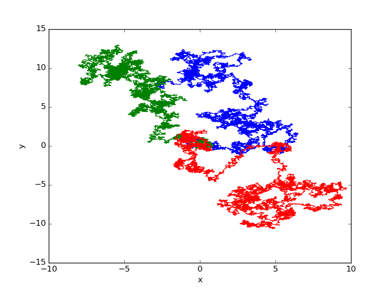

.. _grafik:

***********************
Erstellung von Grafiken
***********************

Häufig ist es notwendig, die numerischen Ergebnisse eines Programms in
grafischer Weise darzustellen. Hierzu gibt es verschiedene Möglichkeiten.  Man
kann beispielsweise die Ergebnisse zunächst in einer Datei abspeichern und dann
mit Hilfe eines speziellen Programms eine grafische Aufbereitung vornehmen. In
diesem zweiten Schritt kann man eigene, in Python oder einer anderen Sprache
geschriebene Programme einsetzen oder aber auf existierende Programme
zurückgreifen. Es gibt eine Vielzahl solcher Programme, aus denen man je nach
den jeweiligen Anforderungen ein geeignetes auswählen kann. Ein häufig
verwendetes Programm zur Darstellung numerischer Daten ist zum Beispiel
**gnuplot** [#gnuplot]_. 

Möchte man die Erzeugung der Grafik mit einem eigenen Python-Programm 
bewerkstelligen, so greift man sinnvollerweise auf vorhandene Programmbibliotheken
wie **matplotlib** [#matplotlib]_ oder **PyX** [#pyx]_ zurück. Da in einem solchen Fall sowohl
die Daten als auch die Grafik in einem Python-Programm erzeugt werden, hat
man die Möglichkeit, beide Schritte in dem gleichen Programm auszuführen.
Lassen sich die Daten jedoch nur mit großem numerischem Aufwand erhalten,
so sollte man daran denken, die Daten abzuspeichern, selbst wenn man die
Grafik anschließend direkt erzeugt. Nichts ist ärgerlicher, als viel Rechenzeit
in den Sand gesetzt zu haben, weil der Grafikteil einen Programmierfehler enthielt
und so die errechneten Daten letztlich verloren gingen. Gegebenenfalls kann man den
Grafikteil des Programms mit schnell erzeugbaren Daten testen.

Im Folgenden werden wir eine Einführung in die Benutzung von ``matplotlib`` und
``PyX`` geben, die allerdings beide wesentlich mächtiger sind als es in diesem
Rahmen gezeigt werden kann. Die Beschreibung kann also nur einen allerersten Eindruck
geben. Für einen guten Überblick über die Möglichkeiten dieser
Grafikmodule empfiehlt sich ein Blick auf die Beispielseiten 
http://matplotlib.org/gallery.html und die Unterseiten von 
http://pyx.sourceforge.net/examples/index.html und http://sourceforge.net/p/pyx/gallery/index.

matplotlib
**********

Nachdem SciPy/NumPy keine grafischen Fähigkeiten besitzt, wird in diesem Umfeld
zur Erzeugung von Grafiken häufig ``matplotlib`` empfohlen, das unter anderem
auf den Array-Datentyp von NumPy zurückgreift.  ``matplotlib`` kann auf zwei
verschiedene Arten verwendet werden. Zum einen kann man mit Hilfe des
Python-Interpreters durch direkte Eingabe von Kommandos schnell Grafiken
erzeugen.  Zum anderen kann man Grafiken aber auch mit einem vollständigen
Python-Programm erstellen.  Letzteres ist vor allem dann sinnvoll, wenn man
Eigenschaften der Grafik im Detail festlegen will. Wir beginnen zunächst mit der
ersten Variante und betrachten ein Beispiel, in dem zwei Besselfunktionen unter
Verwendung von SciPy dargestellt werden.

.. code-block:: python
   :linenos:

   >>> import numpy as np
   >>> import matplotlib.pyplot as plt
   >>> from scipy.special import j0, j1
   >>> x = np.arange(0, 50, 0.2)
   >>> y1 = j0(x)
   >>> y2 = j1(x)
   >>> plt.plot(x, y1)
   [<matplotlib.lines.Line2D object at 0xa273f0c>]
   >>> plt.plot(x, y2)
   [<matplotlib.lines.Line2D object at 0xa2732cc>]
   >>> plt.show()

In Zeile 1 wird zunächst das NumPy-Paket geladen, um in Zeile 4 ein Array mit
``x``-Werten erzeugen zu können. Anschließend wird in Zeile 2 die
Plot-Funktionalität von ``matplotlib``, soweit sie im Folgenden benötigt wird,
geladen [#pylab]_. Auch hier wird, wie schon bei NumPy, eine übliche Abkürzung
eingeführt, um Tipparbeit zu sparen.  Schließlich werden in der Zeile 3 zwei
Besselfunktionen aus SciPy importiert, die im Weiteren dargestellt werden
sollen. In Zeile 4 wird nun, wie schon angedeutet, ein Array mit den
``x``-Werten erzeugt, für die in den folgenden beiden Zeilen Arrays mit den
Besselfunktionen :math:`J_0(x)` und :math:`J_1(x)` berechnet werden. In den
Zeilen 7-10 werden dann die beiden Funktionsgraphen erzeugt. Wie die Zeilen 8
und 10 andeuten, handelt es sich dabei um ``matplotlib.lines.Line2D``-Objekte.
Abschließend erfolgt die Darstellung des Graphen in Zeile 11. Die Ausgabe
erfolgt auf den Bildschirm, wo die Grafik in einem Fenster, wie in der
folgenden Abbildung gezeigt, dargestellt wird.

.. image:: images/matplotlib/matplotlib1.png
   :width: 9cm
   :align: center

Die Knöpfe am linken unteren Rand des Fensters kann man benutzen, um zum
Beispiel in die Grafik hineinzuzoomen wie es die folgende Abbildung zeigt oder
den dargestellten Ausschnitt zu verschieben.

Mit dem Haussymbol kommt man immer wieder zu der ursprünglichen Darstellung zurück.

Alternativ zu dieser interaktiven Arbeitsweise kann man Grafiken auch mit Hilfe
eines normalen Python-Programms erzeugen. Als Beispiel wollen wir ein Programm
betrachten, das eine Zufallsbewegung berechnet und darstellt.

.. code-block:: python
   :linenos:

   import numpy as np
   from numpy.random import rand
   import matplotlib.pyplot as plt
   from math import pi
   
   npts = 10000
   r = 0.1
   for _ in range(3):
       x = np.zeros(npts+1)
       y = np.zeros(npts+1)
       richtung = 2*pi*rand(npts)
       x[1:] = np.cumsum(r*np.cos(richtung))
       y[1:] = np.cumsum(r*np.sin(richtung))
       plt.plot(x, y)
   
   plt.xlabel("x")
   plt.ylabel("y")
   plt.savefig("randomwalk.pdf")

In den ersten vier Zeilen werden zunächst wieder wie gewohnt Module importiert,
wobei in Zeile 2 eine Funktion zur Erzeugung von Zufallszahlen aus NumPy
importiert wird. Die Zufallsbewegung wird nun in einer diskreten Weise durch
``npts`` Punkte spezifiziert, wobei jeweils ein Schritt der Länge ``r`` in eine
Zufallsrichtung, die durch ein Element des Arrays ``richtung`` festgelegt ist,
ausgeführt wird. Diese Schritte werden in den Zeilen 12 und 13 kumulativ
aufsummiert, um die Trajektorien zu erzeugen. Durch die Zeilen 9 und 10 und die
verschobene Indizierung in den Zeilen 12 und 13 wird dafür gesorgt, dass alle
Trajektorien im Ursprung starten. Die durch die Werte in ``x`` und ``y``
definierte Trajektorie wird in Zeile 14 geplottet.  Insgesamt wird dieser
Vorgang mit Hilfe der ``for``-Schleife dreimal durchgeführt. Abschließend wird
noch eine Achsenbeschriftung hinzugefügt und schließlich die Abbildung in einer
PDF-Datei abgespeichert, die im Folgenden dargestellt ist.

Hier stellt man fest, dass ``matplotlib`` automatisch die Farbe der Linien wechselt.
Alternativ hätte man die Farben auch explizit spezifizieren können.

PyX
***

Eine mögliche Alternative zu ``matplotlib`` stellt ``PyX`` dar, das
von André Wobst und Jörg Lehmann, in der Anfangsphase der Programmentwicklung
als Doktoranden am Lehrstuhl für Theoretische Physik I der Universität Augsburg
tätig, programmiert wurde und noch weiterentwickelt wird. Etwas später kam noch
Michael Schindler hinzu. Die drei Buchstaben in ``PyX`` stehen für
»Postscript«, »Python« und »(La)TeX« [#latex]_.  Postscript wurde als
Ausgabeformat inzwischen noch durch PDF erweitert.  ``PyX`` ist in Python
geschrieben und wird zur Erzeugung von Grafiken in Python-Programme importiert.
Zudem lassen sich bei Bedarf in Python eigene Erweiterungen programmieren.
(La)TeX schließlich wird für eine qualitativ hochwertige Textausgabe benutzt,
wobei ``matplotlib`` ähnliche Möglichkeiten bietet. Seit Version 0.13 läuft
``PyX`` ausschließlich unter Python 3.

Mit ``PyX`` lassen sich nicht nur Graphen erstellen, sondern auch
Schemazeichnungen erzeugen. So wurden die meisten Abbildungen in diesem
Manuskript mit ``PyX`` erstellt.

Sehen wir uns zunächst an, wie aus einem in einer Datei vorliegenden Datensatz
eine graphische Darstellung erzeugt werden kann. Liegt eine Datei
``foo_pyx.dat`` mit folgendem Inhalt 

.. code-block:: python

   1   0
   2   1
   3   4
   4   2.5
   5   6

vor, so erzeugt das Programm

.. code-block:: python
   :linenos:

   from pyx import *

   g = graph.graphxy(width=8)
   g.plot(graph.data.file("foo_pyx.dat", x=1, y=2))
   g.writePDFfile("foo_pyx")

eine PDF-Datei mit Namen ``foo_pyx.pdf``, die folgendermaßen aussieht.

.. image:: images/pyx/pyx1.*
   :width: 8cm
   :align: center

In Zeile 1 wird zunächst ``PyX`` importiert. Anschließend wird in Zeile 3 ein
zweidimensionaler Graph der Breite ``8`` erzeugt. Wird die Höhe des Graphen
nicht spezifiziert, so ist das Seitenverhältnis durch den goldenen Schnitt
gegeben. In Zeile 4 werden die Daten aus der angegebenen Datei eingelesen und
in den gerade initialisierten Graphen gezeichnet. Dabei geben die Werte der
benannten Argumente ``x`` und ``y`` die Spalten an, aus denen die jeweiligen
Daten zu entnehmen sind. Schließlich wird mit der ``writePDFfile``-Methode
die PDF-Datei erzeugt.

Um einen gewissen Einblick in die Möglichkeiten von PyX zu gewinnen, wollen
wir diese Graphik nun modifizieren. Dabei erzeugt der Code

.. code-block:: python
   :linenos:

   from pyx import *
   
   unit.set(xscale=1.3)
   
   g = graph.graphxy(width=8,
                     x=graph.axis.linear(title="$x$"),
                     y=graph.axis.linear(title="$y$")
                    )
   g.plot(graph.data.file("foo_pyx.dat", x=1, y=2),
          [graph.style.line([style.linestyle.dashed, color.rgb(0, 0, 1)]),
           graph.style.symbol(graph.style.symbol.circle, size=0.1,
                              symbolattrs=[deco.filled([color.rgb.red]),
                                           deco.stroked([color.grey(0.5)])])])
   g.writePDFfile("foo_pyx")

die folgende Grafik

.. image:: images/pyx/pyx2.*
   :width: 8cm
   :align: center

Hier haben wir die folgenden Veränderungen vorgenommen. In Zeile 3 wurden alle
Beschriftungen um einen Faktor 1,3 vergrößert. ``PyX`` erlaubt es, verschiedene
Längen, zum Beispiel Textgrößen und Liniendicken unabhängig voneinander global
zu verändern. ``xscale`` ist dabei für die Textgröße zuständig. In den Zeilen 
6 und 7 wurden die beiden Achsen mit Beschriftungen versehen, wobei die Dollarzeichen
durch ``TeX`` bedingt sind und ein Umschalten in den Mathematikmodus bewirken.
Außerdem werden hier lineare Achsen verwendet. Mit ``graph.axis.logarithmic`` könnte
man auch logarithmische Achsen verlangen. Zudem wäre es möglich, eigene Achsentypen
zu programmieren.

In den Zeilen 9-12 wird die Darstellung der Daten festgelegt. In diesem Fall
haben wir angegeben, dass wir die Datenpunkte sowohl durch Symbole darstellen als auch
mit Linien verbinden wollen. Letzteres geschieht mit ``graph.style.line``, das
als Argument eine Liste von Linieneigenschaften erwartet. Hier haben wir einen
gestrichelten Linienstil und die Farbe blau im RGB-Format [#rgb]_ verlangt. Für
die Symbole haben wir mit ``graph.style.symbol.circle`` Kreise ausgewählt,
deren Größe durch den Wert des Arguments ``size`` bestimmt ist. Zudem kann eine
Liste von Attributen übergeben werden.  Wir verlangen beispielsweise, dass
die Kreise rot gefüllt sind, wobei hier zur Abwechslung der Farbenname verwendet
wurde. Außerdem wird die Kontur des Kreises in grau ausgeführt, da
``color.grey`` mit einem Argument zwischen Null und Eins auf einen Grauwert
zwischen schwarz und weiß abgebildet wird. Man sieht in diesem
Programmbeispiel, dass man sich einiges an Tipparbeit durch geeignete
``import``-Anweisungen zu Beginn des Programms sparen könnte.

Wir beenden dieses Kapitel mit einem Beispiel von der `PyX-Webseite
<http://pyx.sourceforge.net/>`_, das die Mächtigkeit des Programmpakets bei
Schemazeichnungen demonstriert.

.. code-block:: python
   :linenos:

   from pyx import *
   
   p1 = path.curve(0, 0, 1, 0, 1, 1, 2, 1)
   p2 = path.circle(1, 0.5, 0.5)
   
   (a1, a2), (b1, b2) = p1.intersect(p2)
   
   x1, y1 = p1.at(a1)
   x2, y2 = p1.at(a2)
   
   c = canvas.canvas()
   c.fill(path.circle(x1, y1, 0.1), [color.rgb.blue])
   c.fill(path.circle(x2, y2, 0.1), [color.rgb.blue])
   c.stroke(p1, [color.rgb.red])
   c.stroke(p2, [color.rgb.green])
   c.writePDFfile("intersect")

Das Ergebnis sieht folgendermaßen aus:

.. image:: images/pyx/pyx3.*
   :width: 6cm
   :align: center

In den Zeilen 3 und 4 werden zunächst zwei Pfade definiert, und zwar eine
Bézier-Kurve ``p1`` und ein Kreis ``p2``.  In Zeile 6 werden die beiden
Pfade miteinander geschnitten. Das Ergebnis sind zwei Tupel, die die
Lage der beiden Schnittpunkte entlang der beiden Kurven angeben. Die 
zugehörigen Koordinaten werden in den Zeilen 8 und 9 mit Hilfe der ersten
Kurve bestimmt. In Zeile 11 beginnt das Zeichnen mit der Einrichtung eines
»canvas«, also einer Leinwand, auf der gemalt werden kann. Dann werden
in den Zeilen 12 und 13 an den zuvor berechneten Schnittpunkten zwei blau
gefüllte Kreise mit Radius ``0.1`` positioniert. Schließlich werden die
beiden Pfade in rot bzw. grün gezeichnet und das Ergebnis mit Hilfe der
``writePDFfile``-Methode des Canvas ausgegeben.

Abschließend muss noch einmal betont werden, dass sowohl die Beschreibung von
``matplotlib`` als auch die Beschreibung von ``PyX`` nur jeweils einen winzigen
Ausschnitt aus den Möglichkeiten der beiden Programmpakete darstellen konnten.
Einen guten Überblick bieten die oben bereits erwähnten Beispielseiten.

.. [#gnuplot] Für weitere Informationen siehe die `Gnuplot-Webseite
   <http://www.gnuplot.info/>`_.
.. [#matplotlib] Die Programmbibliothek zum Herunterladen und weitere Informationen findet
   man auf der `matplotlib-Webseite <http://matplotlib.sourceforge.net/>`_.
.. [#pyx] Die Programmbibliothek zum Herunterladen und weitere Informationen findet man auf
   der `PyX-Webseite <http://pyx.sourceforge.net/>`_. 
.. [#pylab] Das Laden der Module in den ersten beiden Zeilen wird überflüssig, wenn
   man die erweiterte Python-Shell ``ipython`` mit der Option ``-pylab`` verwendet. 
   Dann führt jede ``plot``-Anweisung zu einer Aktualisierung der in einem externen 
   Fenster angezeigten Grafik.
.. [#latex] Daher benötigt PyX auch ein installiertes TeX-System. Da es sich dabei um ein
   sehr mächtiges Textsatzsystem handelt, das im wissenschaftlichen Umfeld stark genutzt
   wird, lohnt sich eine Installation auch unabhängig von PyX. Für weitere Informationen siehe
   zum Beispiel http://www.tug.org/texlive/ oder auch http://www.dante.de/tex/tl-install-windows.html.
.. [#rgb] RGB steht für »red«, »green« und »blue«, wobei hier die Stärke jeder Komponente
   durch eine Zahl zwischen Null und Eins angegeben wird.
